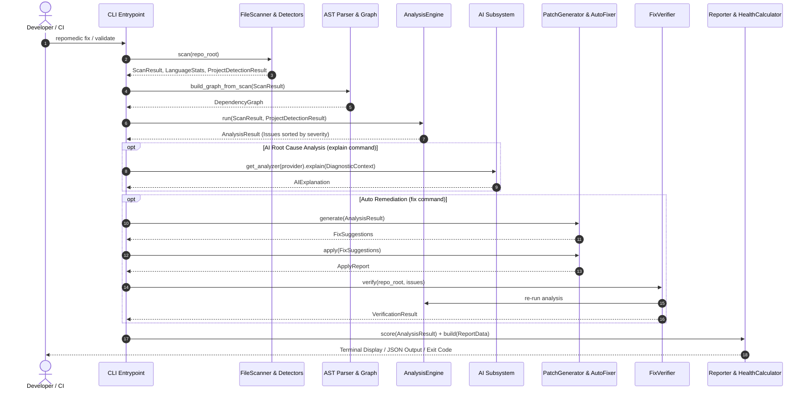
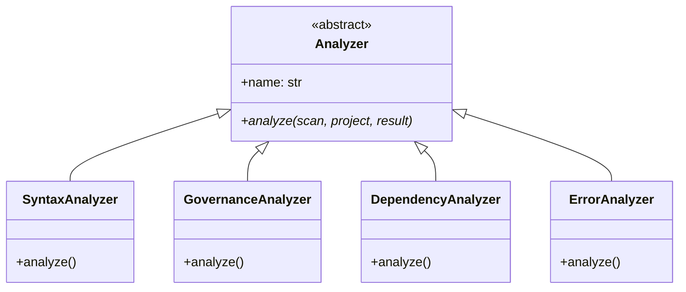
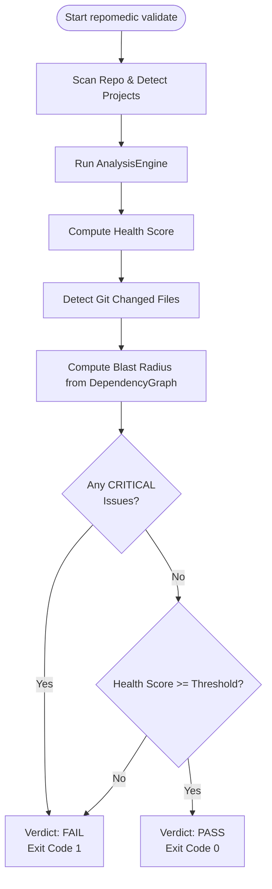
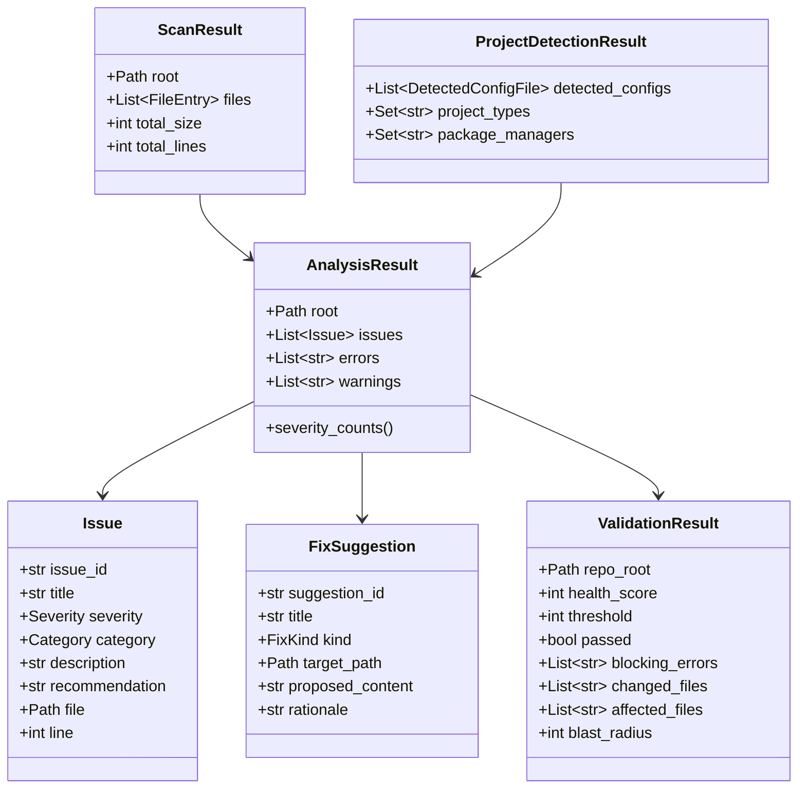

# RepoMedic Architecture & System Design

[](https://www.python.org/downloads/)
[](https://opensource.org/licenses/MIT)
[](#core-design-principles)

RepoMedic is an automated repository health analysis, diagnostic, and safe remediation platform. It inspects software repositories, identifies structural, syntax, dependency, and governance defects, calculates deterministic health scores, assesses downstream blast radius, provides AI-driven root-cause explanations, safely applies verified fixes, and enforces CI/CD quality gates.

---

## Table of Contents

- [1. Executive Summary](#1-executive-summary)
- [2. High-Level Architecture](#2-high-level-architecture)
- [3. Core Design Principles](#3-core-design-principles)
- [4. End-to-End Pipeline & Data Flow](#4-end-to-end-pipeline--data-flow)
- [5. Subsystem Architecture](#5-subsystem-architecture)
  - [5.1 CLI & Presentation Layer (`repomedic.cli`)](#51-cli--presentation-layer-repomediccli)
  - [5.2 Scanner Subsystem (`repomedic.scanner`)](#52-scanner-subsystem-repomedicscanner)
  - [5.3 Graph & Blast Radius Subsystem (`repomedic.graph`)](#53-graph--blast-radius-subsystem-repomedicgraph)
  - [5.4 Analyzer Subsystem (`repomedic.analyzer`)](#54-analyzer-subsystem-repomedicanalyzer)
  - [5.5 AI Diagnostic Subsystem (`repomedic.ai`)](#55-ai-diagnostic-subsystem-repomedicai)
  - [5.6 Fixer Subsystem (`repomedic.fixer`)](#56-fixer-subsystem-repomedicfixer)
  - [5.7 Reporter Subsystem (`repomedic.reporter`)](#57-reporter-subsystem-repomedicreporter)
  - [5.8 Validator & Quality Gate Subsystem (`repomedic.validator`)](#58-validator--quality-gate-subsystem-repomedicvalidator)
- [6. Data Models & Domain Schemas](#6-data-models--domain-schemas)
- [7. Safety Guarantees & Non-Destructive Invariants](#7-safety-guarantees--non-destructive-invariants)
- [8. Repository Directory Layout](#8-repository-directory-layout)
- [9. Extensibility Guide](#9-extensibility-guide)

---

## 1. Executive Summary

Modern engineering teams encounter repository rot: missing governance files, syntax anomalies, undeclared dependencies, import cycles, and fragile downstream integrations. RepoMedic addresses this with a cohesive, zero-damage static analysis and repair pipeline:

1. **Discovery:** Scans repository trees, respects standard ignore boundaries, detects primary and secondary programming languages, and identifies project metadata/manifests.
2. **Graph Modeling:** Parses Python Abstract Syntax Trees (AST) into an in-memory directed dependency graph and calculates transitive blast radiuses for modified files.
3. **Multi-Domain Analysis:** Evaluates syntax validity, governance conformance, dependency integrity, and code error states.
4. **AI-Powered Root-Cause Analysis:** Synthesizes structured diagnostic contexts and generates actionable explanations via pluggable AI backends (offline deterministic mocks or online OpenAI completions).
5. **Safe Remediation:** Proposes file patches from structured templates and applies them with a strict zero-overwrite invariant.
6. **Closed-Loop Verification:** Re-analyzes repositories post-fix to mathematically confirm issue resolution.
7. **CI/CD Quality Gating:** Implements deterministic health scoring (0–100) and threshold-enforced validation with standardized exit codes.

---

## 2. High-Level Architecture

The following diagram illustrates RepoMedic's decoupled subsystems and their unidirectional interactions:

```mermaid
graph TD
    User([CLI / CI/CD Pipeline]) -->|Commands: scan, analyze, explain, fix, report, validate| CLI[repomedic.cli]

    subgraph Core Pipeline
        CLI --> SCAN[Scanner Subsystem]
        SCAN -->|ScanResult & ProjectDetectionResult| GRAPH[Graph Subsystem]
        SCAN -->|ScanResult & ProjectDetectionResult| ANALYZER[Analyzer Subsystem]
        
        GRAPH -->|DependencyGraph & BlastRadiusResult| ANALYZER
        ANALYZER -->|AnalysisResult (Issues & Errors)| AI[AI Diagnostics Subsystem]
        ANALYZER -->|AnalysisResult| FIXER[Fixer Subsystem]
        ANALYZER -->|AnalysisResult| REPORTER[Reporter Subsystem]

        FIXER -->|ApplyReport| VERIFIER[Fix Verifier]
        VERIFIER -->|Re-evaluates| ANALYZER

        SCAN & GRAPH & ANALYZER & REPORTER --> VALIDATOR[Validator Subsystem]
    end

    subgraph Outputs & Effects
        REPORTER -->|Terminal ANSI / JSON| STDOUT([Terminal & JSON Reports])
        FIXER -->|Safe Non-destructive File Creation| FS[(Repository Filesystem)]
        VALIDATOR -->|Exit Code: 0 PASS / 1 FAIL / 2 ERROR| GATE([CI/CD Quality Gate])
    end
```

---

## 3. Core Design Principles

| Principle | Description |
| :--- | :--- |
| **Zero-Damage Invariant** | RepoMedic will never overwrite, truncate, or delete existing files. Fix operations are constrained to safe creations (e.g., standard `.gitignore`, `README.md`, `LICENSE`). |
| **Deterministic Scoring** | Given identical findings, the health score calculation is idempotent, monotonic, and completely pure (independent of execution order or system environment). |
| **Decoupled Subsystems** | Subsystems communicate via immutable, typed dataclasses. No subsystem directly mutates global state or relies on hidden side-effects. |
| **Zero Heavy Dependencies** | The core analysis and graph traversal rely on Python's built-in standard library (`ast`, `pathlib`, `dataclasses`, `enum`) and standard CLI primitives (`click`). |
| **Offline-First Resilience** | The AI analysis subsystem includes a deterministic `MockAIProvider` allowing the full pipeline, testing suite, and CI builds to operate without internet or API keys. |
| **Closed-Loop Verification** | Any fix applied by the system is immediately re-analyzed by the `FixVerifier` to confirm that the offending issue is resolved without introducing regressions. |

---

## 4. End-to-End Pipeline & Data Flow

The sequential lifecycle of an analysis, diagnosis, repair, and validation run:



---

## 5. Subsystem Architecture

### 5.1 CLI & Presentation Layer (`repomedic.cli`)

- **Package:** `repomedic.cli`
- **Main Files:** `main.py`, `commands/validate.py`
- **Entrypoints:** `repomedic` CLI command and `python -m repomedic`

#### Responsibilities
- Parses command-line flags and parameters using `click`.
- Dispatches user requests to the appropriate subsystems.
- Renders stylized ANSI console output with smart terminal detection (`sys.stdout.isatty()`).
- Returns standardized POSIX process exit codes for automated integration.

#### CLI Command Map

| Command | Purpose | Key Flags | Exit Codes |
| :--- | :--- | :--- | :--- |
| `repomedic scan` | Walk repository, categorize file types, detect project configs | `--format [text\|json]`, `--top <int>` | `0` (Success), `1` (Scan Error) |
| `repomedic analyze` | Execute analysis engine and print categorized issues | `--severity [critical\|high\|...]`, `--category [...]` | `0` (Success), `1` (Scan Error) |
| `repomedic explain` | AI diagnosis and root-cause breakdown | `--provider [mock\|openai]`, `--issue <id>` | `0` (Success), `1` (AI Error) |
| `repomedic fix` | Propose, preview, and apply non-destructive fixes | `--dry-run`, `--yes`, `--project-name`, `--author` | `0` (Success), `1` (Fix Error) |
| `repomedic report` | Generate comprehensive repository health score & metrics | `--format [text\|json]`, `--output <file>` | `0` (Success), `1` (Report Error) |
| `repomedic validate` | Quality gate for CI/CD checking threshold and blockers | `--fail-under <0-100>` | `0` (PASS), `1` (FAIL), `2` (ERROR) |

---

### 5.2 Scanner Subsystem (`repomedic.scanner`)

- **Package:** `repomedic.scanner`
- **Key Modules:**
  - `file_scanner.py`: `FileScanner`, `ScanResult`, `FileEntry`, `ScanError`
  - `language_detector.py`: `LanguageDetector`, `LanguageStats`, `LanguageDetectionResult`
  - `project_detector.py`: `ProjectDetector`, `ProjectDetectionResult`, `DetectedConfigFile`

#### Internal Mechanics
1. **File Traversal:** Walks the file tree while strictly pruning ignored directories (`.git`, `node_modules`, `__pycache__`, `.venv`, `.tox`, `dist`, `build`, etc.) defined in `DEFAULT_IGNORE_DIRS`.
2. **Metadata Aggregation:** Captures file paths, byte sizes, line counts (with UTF-8 and latin-1 fallback decoders), and extensions.
3. **Language Detection:** Maps file extensions across major ecosystems (Python, JavaScript, TypeScript, Rust, Go, Java, C/C++, HTML, CSS, Markdown, YAML, etc.) and computes file and line percentages.
4. **Project Type Identification:** Identifies toolchains by inspecting configuration manifests:
   - Python: `pyproject.toml`, `setup.py`, `requirements.txt`, `Pipfile`
   - Node.js: `package.json`, `tsconfig.json`
   - Rust: `Cargo.toml`
   - Go: `go.mod`
   - Java: `pom.xml`, `build.gradle`
   - Infrastructure & CI: `Dockerfile`, `.github/workflows`

---

### 5.3 Graph & Blast Radius Subsystem (`repomedic.graph`)

- **Package:** `repomedic.graph`
- **Key Modules:**
  - `ast_parser.py`: `ASTParser`, `ParseResult`
  - `graph.py`: `DependencyGraph`
  - `blast_radius.py`: `BlastRadiusAnalyzer`, `BlastRadiusResult`
  - `factory.py`: `build_graph_from_scan`

#### AST Parsing & Import Resolution
`ASTParser` parses Python source files into standard `ast.AST` trees:
- Extracts `import foo` and `from foo import bar` statements.
- Distinguishes between internal module imports and third-party/stdlib dependencies.
- Handles relative imports (`from . import helper`, `from ..sub import mod`).
- Captures syntax errors gracefully without crashing the pipeline.

#### Dependency Graph & Cycle Detection
`DependencyGraph` maintains a directed graph:
- **Dependencies (Out-edges):** $A \rightarrow B$ means file $A$ imports module $B$.
- **Dependents (In-edges):** Reverse mapping showing which files import $B$.
- **Cycle Detection:** Implements Tarjan's / Depth-First Search cycle detection to pinpoint circular imports causing import-time deadlocks.

#### Blast Radius Computation
When files are modified (e.g., in a Git commit or pull request), `BlastRadiusAnalyzer` performs a reverse Breadth-First Search (BFS) starting from the modified files along the in-edge graph:

$$\text{Blast Radius} = \text{Transitive Dependents of } \{\text{Changed Files}\} \setminus \{\text{Changed Files}\}$$

This informs developers and CI gates of the exact downstream surface area impacted by a code change.

---

### 5.4 Analyzer Subsystem (`repomedic.analyzer`)

- **Package:** `repomedic.analyzer`
- **Key Modules:**
  - `engine.py`: `AnalysisEngine`, `DEFAULT_ANALYZERS`
  - `base.py`: `Analyzer` abstract base class
  - `syntax.py`: `SyntaxAnalyzer`
  - `governance.py`: `GovernanceAnalyzer`
  - `dependency.py`: `DependencyAnalyzer`
  - `error.py`: `ErrorAnalyzer`
  - `models.py`: `Issue`, `AnalysisResult`, `Severity`, `Category`

#### Analyzer Suite



1. **`SyntaxAnalyzer`:**
   - Scans all Python files via `ast.parse`.
   - Records line-precise `CRITICAL` syntax errors that prevent execution or compilation.
2. **`GovernanceAnalyzer`:**
   - Checks repository hygiene: presence of `.gitignore`, `README.md`, and open-source `LICENSE`.
   - Emits structured `MEDIUM` issues with recommended templates when absent.
3. **`DependencyAnalyzer`:**
   - Detects circular dependencies within the repository import graph.
   - Detects undeclared imports or broken relative references.
4. **`ErrorAnalyzer`:**
   - Detects problematic code constructs, bare `except:` clauses, suppressed critical exceptions, and lingering `TODO`/`FIXME` debt tags.

#### Issue Severity Classification

| Severity | Rank | Color Code | Impact & Meaning |
| :--- | :---: | :--- | :--- |
| **`CRITICAL`** | 4 | Magenta | Blocks execution (e.g., syntax failure, fatal configuration). Always causes `repomedic validate` to FAIL. |
| **`HIGH`** | 3 | Red | Major bug, circular dependency, or high-risk structural flaw. |
| **`MEDIUM`** | 2 | Yellow | Governance gap (missing `.gitignore`, `LICENSE`, `README.md`) or fragile dependency. |
| **`LOW`** | 1 | Blue | Code smell, non-blocking anti-pattern, or maintenance risk. |
| **`INFO`** | 0 | Cyan | Informational diagnostic or optimization recommendation. |

---

### 5.5 AI Diagnostic Subsystem (`repomedic.ai`)

- **Package:** `repomedic.ai`
- **Key Modules:**
  - `base.py`: `AIAnalyzer`, `AIProviderError`
  - `context_builder.py`: `ContextBuilder`
  - `models.py`: `DiagnosticContext`, `AIExplanation`, `CodeSnippet`, `SyntaxErrorInfo`
  - `registry.py`: `get_analyzer`, `ProviderNotAvailableError`
  - `mock_provider.py`: `MockAIProvider`
  - `openai_provider.py`: `OpenAIProvider`

#### Context Synthesis (`ContextBuilder`)
Rather than sending raw repository dumps to an LLM, RepoMedic constructs an optimized `DiagnosticContext`:
- Isolates the top-priority issue and related syntax errors.
- Extracts targeted code snippets around offending lines (e.g., 5 lines before and after).
- Injects immediate graph dependencies and downstream dependents.
- Formulates a system prompt strictly constraining the AI to return structured diagnoses.

#### Providers
- **`MockAIProvider` (Default):** Runs completely offline with deterministic heuristics. Infers root causes from syntax error messages and issue metadata, constructs recommended remedies, and estimates confidence without network requests.
- **`OpenAIProvider`:** Integrates with OpenAI's Chat Completions API (using `gpt-4o` or configured models) via standard HTTP interfaces, decoding responses into structured `AIExplanation` objects.

---

### 5.6 Fixer Subsystem (`repomedic.fixer`)

- **Package:** `repomedic.fixer`
- **Key Modules:**
  - `patch_generator.py`: `PatchGenerator`
  - `auto_fixer.py`: `AutoFixer`
  - `verifier.py`: `FixVerifier`
  - `templates.py`: Curated templates for `.gitignore`, `README.md`, `LICENSE` (MIT)
  - `models.py`: `FixSuggestion`, `FixResult`, `FixStatus`, `ApplyReport`, `VerificationResult`

#### Execution Workflow
1. **Proposal (`PatchGenerator`):** Scans `AnalysisResult` for fixable issues (currently governance gaps). Instantiates `FixSuggestion` objects populated with template contents, variable substitutions (`{{PROJECT_NAME}}`, `{{AUTHOR}}`, `{{YEAR}}`), and rationale.
2. **Safe Execution (`AutoFixer`):**
   - Supports dry-run simulation mode (`--dry-run`).
   - Resolves target paths relative to repo root.
   - Enforces the **Zero-Overwrite Safety Rule**: if target file exists, marks the fix as `FixStatus.SKIPPED`.
   - On permission or I/O failure, marks as `FixStatus.ERROR` without interrupting subsequent fixes.
3. **Post-Fix Verification (`FixVerifier`):**
   - Immediately invokes `AnalysisEngine` on the modified repository.
   - Compares previous issues against post-fix issues to confirm status: `RESOLVED`, `STILL_PRESENT`, or `REGRESSION`.

---

### 5.7 Reporter Subsystem (`repomedic.reporter`)

- **Package:** `repomedic.reporter`
- **Key Modules:**
  - `health_score.py`: `HealthScoreCalculator`, `DEDUCTIONS`
  - `builder.py`: `ReportBuilder`
  - `terminal.py`: `TerminalReporter`
  - `json_reporter.py`: `JSONReporter`
  - `models.py`: `ReportData`

#### Health Score Formula
The repository health score is a deterministic integer in $[0, 100]$:

$$\text{Score} = \max\left(0, \min\left(100, 100 - \sum_{i \in \text{Issues}} \text{Deduction}(i.\text{severity}) - (\text{Errors} \times 5)\right)\right)$$

| Finding Type | Deduction |
| :--- | :---: |
| `CRITICAL` Issue | **-20 pts** |
| `HIGH` Issue | **-10 pts** |
| `MEDIUM` Issue | **-5 pts** |
| `LOW` Issue | **-2 pts** |
| `INFO` Issue | **-1 pt** |
| Internal Analyzer Crash | **-5 pts** |

#### Status Tiers
- **Healthy (`90–100`):** Repository meets high engineering standards.
- **Warning (`60–89`):** Repository has accumulated technical debt or governance gaps.
- **Error (`0–59`):** Repository has severe defects, broken imports, or syntax failures.

---

### 5.8 Validator & Quality Gate Subsystem (`repomedic.validator`)

- **Package:** `repomedic.validator`
- **Key Modules:**
  - `validator.py`: `RepositoryValidator`
  - `git_detector.py`: `GitChangesDetector`
  - `models.py`: `ValidationResult`

#### CI/CD Validation Logic
`RepositoryValidator` orchestrates the entire system for CI/CD gates:



- **Exit Code 0 (PASS):** Health score is at or above `--fail-under` threshold AND zero `CRITICAL` issues exist.
- **Exit Code 1 (FAIL):** Health score is below threshold OR at least one `CRITICAL` issue was detected.
- **Exit Code 2 (ERROR):** Fatal invocation or scan error (e.g., target directory does not exist).

---

## 6. Data Models & Domain Schemas

RepoMedic models all entities using immutable Python dataclasses:



---

## 7. Safety Guarantees & Non-Destructive Invariants

To maintain safety across enterprise codebases, RepoMedic enforces the following invariants:

1. **No Destructive Operations:** The only automated disk modification supported is `FixKind.CREATE_FILE`. RepoMedic does not delete or rewrite files without explicit developer authorization.
2. **Collision Prevention:** Before creating any file, `AutoFixer` performs a strict `path.exists()` check. If any file or collision is detected, the operation is skipped with `FixStatus.SKIPPED`.
3. **No Execution of Scanned Code:** All analysis is purely static. Code is parsed into ASTs via Python's standard `ast.parse(..., mode="exec")`. RepoMedic never executes `importlib`, `exec()`, or `eval()` on user repository code.
4. **Isolated Subprocess Execution:** The `GitChangesDetector` executes Git commands via `subprocess.run(..., shell=False)` with bounded timeouts and sanitized path arguments.

---

## 8. Repository Directory Layout

```
RepoMedic/
├── documentation/
│   └── architecture.md            # System architecture & engineering specification
├── repomedic/
│   ├── __init__.py                # Package version definition
│   ├── __main__.py                # python -m repomedic entrypoint
│   ├── ai/                        # AI diagnostic and explanation subsystem
│   │   ├── base.py                # AIAnalyzer abstract base class & exceptions
│   │   ├── context_builder.py     # DiagnosticContext extractor & prompt builder
│   │   ├── mock_provider.py       # Offline deterministic rule-based AI provider
│   │   ├── models.py              # Context, CodeSnippet, and AIExplanation models
│   │   ├── openai_provider.py     # OpenAI Chat Completions backend
│   │   └── registry.py            # Provider registry and factory (get_analyzer)
│   ├── analyzer/                  # Multi-domain issue analysis subsystem
│   │   ├── base.py                # Analyzer base interface
│   │   ├── dependency.py          # Circular and missing dependency analyzer
│   │   ├── engine.py              # AnalysisEngine orchestrator
│   │   ├── error.py               # Exception handling & code smells analyzer
│   │   ├── governance.py          # .gitignore, README, LICENSE governance analyzer
│   │   ├── models.py              # Issue, AnalysisResult, Severity, Category models
│   │   └── syntax.py              # Python AST syntax analyzer
│   ├── cli/                       # Presentation and command-line interface
│   │   ├── main.py                # Click CLI group and core command handlers
│   │   └── commands/              # Modular subcommand implementations
│   │       └── validate.py        # Dedicated CI/CD validate command
│   ├── fixer/                     # Automated safe remediation subsystem
│   │   ├── auto_fixer.py          # Safe patch application engine
│   │   ├── models.py              # FixSuggestion, ApplyReport, VerificationResult
│   │   ├── patch_generator.py     # Analysis-to-FixSuggestion translator
│   │   ├── templates.py           # Standard file templates for governance files
│   │   └── verifier.py            # Post-remediation verification engine
│   ├── graph/                     # AST and dependency graph subsystem
│   │   ├── ast_parser.py          # AST import statement extraction
│   │   ├── blast_radius.py        # Reverse-BFS dependency blast-radius analyzer
│   │   ├── factory.py             # ScanResult-to-DependencyGraph factory
│   │   └── graph.py               # Directed graph model with cycle detection
│   ├── reporter/                  # Metric computation and formatting subsystem
│   │   ├── builder.py             # ReportData assembler
│   │   ├── health_score.py        # Deterministic 0-100 scoring calculator
│   │   ├── json_reporter.py       # Machine-readable JSON output formatter
│   │   ├── models.py              # Report data models
│   │   └── terminal.py            # Rich ANSI terminal reporter
│   ├── scanner/                   # Repository discovery and detection subsystem
│   │   ├── file_scanner.py        # File walker and ignore-pattern handler
│   │   ├── language_detector.py   # Extension-to-language detector & stats
│   │   ├── models.py              # FileEntry, ScanResult models
│   │   └── project_detector.py    # Manifest and project-type detector
│   └── validator/                 # Quality gate and verification subsystem
│       ├── git_detector.py        # Git change discovery handler
│       ├── models.py              # ValidationResult data model
│       └── validator.py           # RepositoryValidator orchestration engine
├── tests/                         # Comprehensive unit, integration, and E2E tests
├── pyproject.toml                 # Package definition and build configuration
└── README.md                      # Project introduction and quick-start guide
```

---

## 9. Extensibility Guide

RepoMedic is built for extension across multiple dimensions:

### Adding a New Analyzer
1. Inherit from `repomedic.analyzer.base.Analyzer`.
2. Implement the `analyze(scan_result, project_result, analysis)` method.
3. Emit structured `repomedic.analyzer.models.Issue` objects into `analysis.issues`.
4. Register the new analyzer in `DEFAULT_ANALYZERS` inside [repomedic/analyzer/engine.py](file:///repomedic/analyzer/engine.py).

### Adding an AI Provider
1. Inherit from `repomedic.ai.base.AIAnalyzer`.
2. Implement `explain(context: DiagnosticContext) -> AIExplanation`.
3. Register the provider in `repomedic.ai.registry._PROVIDERS`.

### Supporting New Remediation Templates
1. Add new templates to [repomedic/fixer/templates.py](file:///repomedic/fixer/templates.py).
2. Map corresponding `Issue.title` patterns to template keys in [repomedic/fixer/patch_generator.py](file:///repomedic/fixer/patch_generator.py).
